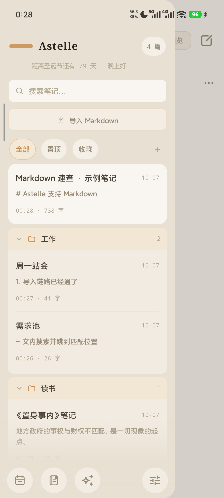

# Astelle

> 打开就能写字的 Android 笔记应用。
> 纸感米色 + 暖橙强调，不跟随系统动态取色 —— 它想有自己的一张脸。

<p align="center">
  
  
</p>

---

## 它是什么

不是又一个「记一下」的工具。核心只有一句：**冷启动直接进编辑器，光标已经在那儿了。**

没有首页列表，没有「新建笔记」按钮，没有启动引导。你打开它，就是打开一张纸。

侧边栏是索引而不是主界面：搜索、筛选、分类。分类的条目**装在一个容器里**，
展开时组头下缘切直角、和内容拼成一张卡；折叠时收成一行 —— 一眼扫过去知道有什么，
点一下看到里面有什么。

## 现状

**开发中** · 可编译、可运行、有测试（`60` 个单测全绿）

| 模块 | 状态 |
|---|---|
| 首页编辑器 | ✅ 完成 |
| 侧边栏抽屉 | ✅ 完成 |
| 分类 / 文件夹 | ✅ 完成 |
| Markdown 预览 | ✅ 完成 |
| 导入 Markdown | ✅ 完成 |
| 导出 Markdown | ⬜ 待做 |
| 日记页 | ⬜ 占位 |
| 计划页 | ⬜ 占位（数据层已就位） |
| 设置页 | ⬜ 占位 |
| AI 页 | ⬜ 未开始 |

缺口清单（含优先级）见 **[docs/04-dev-gaps.md](docs/04-dev-gaps.md)**。

### 已经能用的

- **打开即写** —— 冷启动直接进编辑器，空白草稿立即可输入
- **自动保存** —— 标题 / 正文变更去抖 500ms 落库，保存胶囊三态（未保存 / 保存中 / 已保存）
- **撤销 / 重做** —— 独立的内存历史栈，容量 100，切换笔记时重置
- **Markdown 预览** —— `compose-markdown` 渲染，与编辑态一键切换
- **导入 `.md`** —— 文件名优先作标题，回退到首个 ATX 标题；单文件上限 512 KB
- **笔记管理** —— 新建 / 置顶 / 收藏 / 删除（二次确认）/ 长按菜单
- **分类** —— 抽屉内联新建、重命名、删除；长按卡片「移动到分类」；删分类时笔记自动回到未分类
- **搜索** —— 下推到 SQL，只读摘要投影（见下方「为什么列表不读全文」）
- **系统适配** —— 状态栏 / 导航栏 / 输入法避让；抽屉开着时返回键先关抽屉

### 几处刻意的取舍

| 取舍 | 为什么 |
|---|---|
| 抽屉**不做**吸顶组头 | 分类是一张完整的卡，「组头停在眼前、内容滑走」会把这层关系拆散 |
| 列表**不读正文全文** | 正文可能几十万字。整行读进 SQLite 的 CursorWindow（约 2 MB）会抛 `SQLiteBlobTooBigException`，**打开应用即崩**。列表只取 `substr(content, 1, 280)` 和 `length(content)`，全文只在真正打开某篇时才取 |
| 搜索时**压平**列表 | 搜索是「我要那一篇」，此时还按分类铺开会把结果埋在一串组头里 |
| 未分类**不套容器** | 它是收件箱，不是你建的分组，给它套个文件夹壳反而像多了一层组织 |
| 分类**默认展开**（花笺是默认全收起） | 打开抽屉是为了看笔记，不是先看目录 |

## 技术栈

| | |
|---|---|
| 语言 | Kotlin 2.0.21 |
| UI | Jetpack Compose · Material 3（BOM 2024.10.00） |
| 架构 | MVVM / UDF，单模块 `:app` |
| 依赖注入 | Hilt 2.52（KSP） |
| 数据库 | Room 2.6.1（`astelle.db`，version 4） |
| 导航 | Navigation Compose 2.8.4 |
| 构建 | AGP 8.13.2 · Gradle 8.13 · KSP |
| 最低版本 | Android 8.0（API 26） |

## 构建

需要 **JDK 17+**（Android Studio 自带的 JBR 即可）和 **Android SDK**（`compileSdk 36`）。

```bash
cd AstelleApp
./gradlew :app:assembleDebug
```

产物：`AstelleApp/app/build/outputs/apk/debug/app-debug.apk`

测试：

```bash
./gradlew :app:testDebugUnitTest
```

> `local.properties` 中的 `sdk.dir` 需指向你本机的 Android SDK，该文件不入版本库。

## ⚠️ 数据库迁移

`DatabaseModule` 目前使用 `fallbackToDestructiveMigration()`，数据库为 `version = 4`。

**任何版本号提升都会清空本地全部笔记。** 正式发布前必须换成真正的 `Migration`；
在那之前，导出功能（规划中）是唯一的备份手段。

## 设计资料

视觉以可点原型为准，代码实现应与之一致。

| 资源 | 说明 |
|---|---|
| [`index.html`](index.html) | **可点样式原型**（3 套首页方案 + 侧边栏）· 权威视觉 |
| [docs/ui/01-home-screen.md](docs/ui/01-home-screen.md) | 首页 + 抽屉完整规格（设计 Token、动效、摆位） |
| [docs/ui/02-plans-page-discussion.md](docs/ui/02-plans-page-discussion.md) | 计划页讨论（含 SVG） |
| [docs/ui/03-diary-page-discussion.md](docs/ui/03-diary-page-discussion.md) | 日记页讨论（含 SVG） |

设计上有两条不肯让步的规矩：

1. **颜色只表达状态。** 工具栏图标一律 `Muted`，不拿颜色做装饰。
2. **手机没有 hover。** 所有 hover 态一律改写为 press / selected。

## 目录结构

```
Astelle/
├── AstelleApp/              # Android 工程
│   └── app/src/
│       ├── main/java/com/astelle/app/
│       │   ├── data/        # Room 实体 / DAO / Repository 实现 / 导入解析
│       │   ├── domain/      # 模型 + Repository 接口
│       │   ├── di/          # Hilt 模块
│       │   └── ui/          # home / plans / diary / settings / theme
│       └── test/            # 单元测试（历史栈 / 分组 / 导入 / 搜索转义…）
├── docs/
│   ├── ui/                  # 设计规格
│   └── screenshots/         # README 用图
├── index.html               # 可点原型
└── 图标/                    # 应用图标素材
```

## 许可

尚未指定。在此之前保留所有权利。
